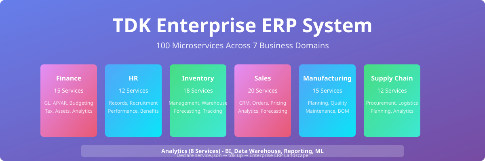
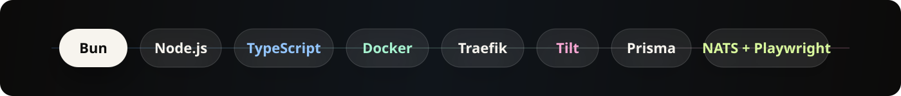
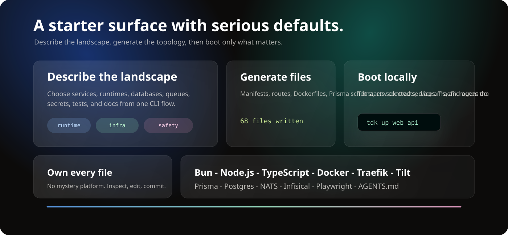
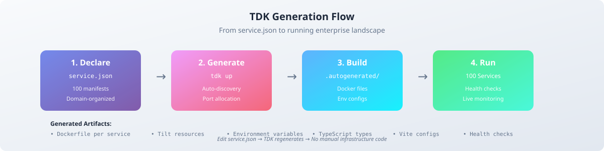

<!-- markdownlint-disable MD013 MD033 MD041 -->

<p align="center">
  
</p>

<p align="center">
  <a href="#run-it">Run it</a>
  &nbsp;&nbsp;/&nbsp;&nbsp;
  <a href="#what-this-is">What this is</a>
  &nbsp;&nbsp;/&nbsp;&nbsp;
  <a href="#inside-the-page">Inside the page</a>
  &nbsp;&nbsp;/&nbsp;&nbsp;
  <a href="#ship-it">Ship it</a>
  &nbsp;&nbsp;/&nbsp;&nbsp;
  <a href="https://github.com/tdk-landscape/tdk-cli">TDK CLI</a>
</p>

<br>

## Forge TDK

`create-tdk-stack` is a polished landing page and starter surface for the TDK CLI: the create-t3-app idea, reimagined for local-first microservice systems.

It presents the generated stack story in one focused React/Vite experience: Bun, Node.js, TypeScript, Docker, Traefik, Tilt, Prisma, PostgreSQL, NATS JetStream, Infisical, Playwright, C4 diagrams, and `AGENTS.md`.

<p align="center">
  
</p>

---

## Run It

### Prerequisites

- [Node.js 22+](https://nodejs.org/) for the local Vite app and GitHub Pages workflow parity.
- npm, included with Node.js.

```bash
git clone https://github.com/tdk-landscape/create-tdk-stack.git
cd create-tdk-stack

npm install
npm run dev
```

The dev server binds to `127.0.0.1` from `package.json`.

```bash
# Build the static site
npm run build

# Preview the production build locally
npm run preview
```

---

## What This Is

Forge TDK is not the generated microservice stack itself. It is the front door: a fast, visual explanation of what `npm create tdk-stack@latest` should feel like for teams who want serious local infrastructure without hand-wiring every service.

The page frames the starter around three ideas:

| Promise | What the UI communicates |
| --- | --- |
| Describe the landscape | Pick service types, runtimes, databases, events, tests, secrets, and docs from one CLI flow. |
| Generate the topology | Produce manifests, Dockerfiles, routes, environment contracts, diagrams, and runnable service code. |
| Boot only what matters | Use Tilt and Traefik to start selected services with hot reload and healthy local URLs. |

<p align="center">
  
</p>

---

## Inside The Page

The app is intentionally small, but the interaction layer is rich enough to sell the product idea:

- Sticky glass navigation with direct jumps to stack, flow, and community sections.
- Cinematic hero with copyable `npm create tdk-stack@latest` command.
- Animated terminal simulation showing the scaffold journey.
- Infinite technology marquee for the generated stack.
- Dense stack grid using Lucide icons for the core tools.
- Scroll-scrubbed manifesto text and pinned build-flow cards powered by GSAP ScrollTrigger.
- High-contrast call to action linking back to the TDK Landscape ecosystem.

```text
create-tdk-stack/
├── .github/workflows/pages.yml
├── docs/
│   ├── readme-bento.svg
│   ├── readme-flow.svg
│   ├── readme-hero.svg
│   └── readme-marquee.svg
├── public/
│   └── favicon.svg
├── src/
│   ├── main.jsx
│   └── styles.css
├── index.html
├── package.json
└── vite.config.js
```

---

## Tech Stack

| Layer | Choice |
| --- | --- |
| App shell | React + Vite |
| Motion | GSAP + ScrollTrigger |
| Icons | Lucide React |
| Styling | Plain CSS with responsive layout and custom effects |
| Build output | Static assets in `dist/` |
| Deployment | GitHub Pages |

The Vite config uses:

```js
base: '/create-tdk-stack/'
```

That keeps asset paths correct when the site is published under the repository path on GitHub Pages.

---

## Ship It

GitHub Pages deployment is already wired in `.github/workflows/pages.yml`.

```bash
git push origin main
```

On every push to `main`, the workflow:

1. Installs dependencies with `npm ci`.
2. Builds the site with `npm run build`.
3. Uploads `dist/` as a Pages artifact.
4. Deploys the static site to GitHub Pages.

You can also trigger the workflow manually from GitHub Actions with `workflow_dispatch`.

---

## The Generated Stack Story

<p align="center">
  
</p>

Forge TDK positions the CLI around a simple path:

```text
answer prompts
  -> generate files
  -> boot locally
  -> inspect, test, and own the stack
```

The product promise is intentionally direct: start small, keep the whole landscape, and avoid mystery infrastructure.

---

<p align="center">
  <strong>Start the stack story. Generate the topology. Keep every file understandable.</strong>
</p>

<p align="center">
  <a href="https://github.com/tdk-landscape">TDK Landscape</a>
  &nbsp;&nbsp;/&nbsp;&nbsp;
  <a href="https://github.com/tdk-landscape/tdk-cli">TDK CLI</a>
  &nbsp;&nbsp;/&nbsp;&nbsp;
  <a href="https://github.com/tdk-landscape/create-tdk-stack">Repository</a>
  &nbsp;&nbsp;/&nbsp;&nbsp;
  MIT License
</p>
